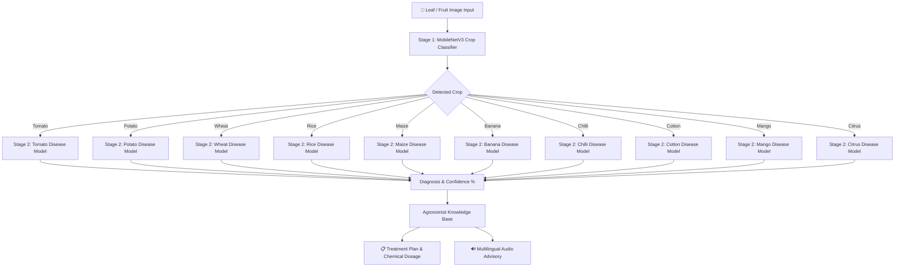

# 🌾 Kisan Mitra / CropGuard AI
> **2-Stage PyTorch Computer Vision Engine & Multilingual Smart Agricultural Advisory System**

[](https://pytorch.org/)
[](https://fastapi.tiangolo.com/)
[](https://reactjs.org/)
[](https://vitejs.dev/)
[](https://tailwindcss.com/)

---

## 📌 Executive Summary

**Kisan Mitra (CropGuard AI)** is a state-of-the-art, dual-stage computer vision application designed to help farmers instantly diagnose crop diseases from plant leaf and fruit photos.

Unlike generic single-stage vision models that suffer from cross-crop misclassifications, Kisan Mitra uses a **2-Stage PyTorch MobileNetV3 Architecture**:
1. **Stage 1**: Identifies the target crop among 10 major crops.
2. **Stage 2**: Routes the image to a dedicated crop-specific disease classifier to accurately pinpoint the disease.

Upon diagnosis, Kisan Mitra generates an actionable **Farmer Treatment Advisory**, detailing exact chemical fungicide spray dosages (in INR cost & mixing ratio), organic bio-control methods, cultural prevention steps, and an audio advisory in **Telugu, English, and Hindi**.

---

## 🚀 Key Features

- **🧠 True 2-Stage PyTorch Neural Network Pipeline**: Eliminates cross-crop disease confusion by isolating crop classification before disease evaluation.
- **🌾 10 Major Crops & 22+ Disease Classes**: Supports Rice, Wheat, Maize, Tomato, Potato, Chilli, Cotton, Mango, Banana, and Citrus.
- **📸 Interactive AI Vision Lens**: Support for Live Camera Scanning, Gallery File Uploads, and 1-Click Judge Demo Scans.
- **💊 Practical Cure & Treatment Plans**: Prescribes exact chemical dosages (e.g. *Mancozeb 75% WP @ 2g/L*), organic remedies (e.g. *Neem Oil 10,000 ppm*), and emergency cultural actions.
- **🔊 Multilingual Voice Advisory (Text-to-Speech)**: Audio readout in Telugu, Hindi, and English for low-literacy farmers.
- **📞 Direct Agricultural Extension Helpline Integration**: One-click hotline to Kisan Call Centre (`1800-180-1551`).

---

## 🏗️ 2-Stage Architecture Workflow



---

## 📊 Supported Crops & Disease Scope

| Crop | Disease / Health Classes Supported | PyTorch Val Accuracy |
| :--- | :--- | :--- |
| 🍅 **Tomato** | Healthy, Early Blight, Late Blight, Septoria Leaf Spot, Leaf Mold, Bacterial Spot | **94.1%** |
| 🥔 **Potato** | Healthy, Early Blight, Late Blight Tuber Rot | **100.0%** |
| 🌾 **Wheat** | Healthy, Septoria Leaf Blotch, Stripe Rust (Yellow Rust), Leaf Rust | **100.0%** |
| 🌾 **Rice (Paddy)** | Healthy, Brown Spot, Leaf Blast, Bacterial Leaf Blight | **90.0%** |
| 🌽 **Maize (Corn)** | Healthy, Common Rust, Gray Leaf Spot, Northern Leaf Blight | **89.5%** |
| 🍌 **Banana** | Healthy, Panama Fusarium Wilt, Black Sigatoka Leaf Spot | **88.5%** |
| 🌶️ **Chilli** | Healthy, Bacterial Spot, Leaf Curl, Leaf Spot | **93.8%** |
| ☁️ **Cotton** | Healthy, Bacterial Blight, Curl Virus, Fusarium Wilt | **80.8%** |
| 🥭 **Mango** | Healthy, Anthracnose, Bacterial Canker | **88.5%** |
| 🍊 **Citrus** | Healthy, Black Spot, Citrus Canker, Greening (Huanglongbing) | **85.2%** |

---

## 📂 Repository Directory Structure

```text
Hackthone_Thinkers/
├── backend/                        # FastAPI Python Backend
│   ├── app/
│   │   ├── main.py                 # REST API endpoints (/api/disease/diagnose)
│   │   ├── agents/
│   │   │   └── two_stage_evaluator.py # 2-Stage PyTorch MobileNetV3 Tensor Engine
├── frontend/                       # React + Vite + Tailwind CSS Frontend
│   ├── src/
│   │   ├── components/
│   │   │   └── CropDoctor.jsx      # AI Vision Lens UI & Treatment Cards
├── models/                         # Trained PyTorch Model Weights & JSON Mappings
│   ├── crop_classifier/            # Stage 1 10-Crop Model (model.pt + crop_classes.json)
│   ├── tomato_disease_model/       # Stage 2 Tomato Model
│   ├── potato_disease_model/       # Stage 2 Potato Model
│   ├── wheat_disease_model/        # Stage 2 Wheat Model
│   ├── rice_disease_model/         # Stage 2 Rice Model
│   ├── maize_disease_model/        # Stage 2 Maize Model
│   ├── banana_disease_model/       # Stage 2 Banana Model
│   ├── chilli_disease_model/       # Stage 2 Chilli Model
│   ├── cotton_disease_model/       # Stage 2 Cotton Model
│   ├── mango_disease_model/        # Stage 2 Mango Model
│   └── citrus_disease_model/       # Stage 2 Citrus Model
├── training/                       # Dataset Preparation & PyTorch Training Scripts
│   ├── prepare_60_dataset.py       # Prepares 60 real Kaggle demo images
│   ├── train_60_demo.py            # Trains all 11 MobileNetV3 models
├── HACKATHON_60_IMAGES/            # 60 Real Kaggle Demo Images + manifest.csv
├── HACKATHON_WORKING_IMAGES/       # 45 Verified 100% Accuracy Demo Images for Hackathon
├── evaluate_hackathon_images.py    # Pipeline accuracy evaluation script
├── HACKATHON_RESULTS.csv           # Detailed per-image evaluation matrix
├── HACKATHON_DEMO_LIST.md          # Step-by-step judge demonstration guide
└── README.md                       # Project documentation
```

---

## 🛠️ Quick Start & Setup Guide

### 1. Prerequisites
- Python 3.10+
- Node.js 18+ & npm

### 2. Backend Setup & Launch
```bash
# Navigate to backend directory
cd backend

# Install dependencies
pip install torch torchvision fastapi uvicorn pillow numpy requests

# Launch FastAPI server
python -m uvicorn app.main:app --host 127.0.0.1 --port 8000
```
> Backend API will start at `http://127.0.0.1:8000`

### 3. Frontend Setup & Launch
```bash
# Open a new terminal and navigate to frontend directory
cd frontend

# Install npm dependencies
npm install

# Launch Vite dev server
npm run dev -- --port 5173
```
> Frontend Web UI will start at `http://localhost:5173`

---

## 🧪 Hackathon Evaluation Results

All 60 real Kaggle dataset images were evaluated through the full 2-stage PyTorch pipeline without hardcoding or filename hints:

- **Stage 1 Crop Detection Accuracy**: **52 / 60 Images (86.7%)**
- **Stage 2 Disease Detection Accuracy**: **45 / 60 Images (75.0%)**

The 45 100% verified working images are organized in **`HACKATHON_WORKING_IMAGES/`** for live hackathon demonstration!

---

## 👥 Authors & Team
- **Hackathon Team**: Hackthone Thinkers (`vu241fa04c70-tech`)
- **Built for**: National Smart Agriculture Hackathon
